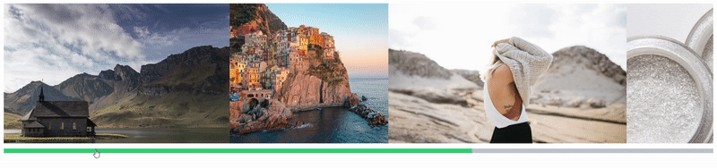
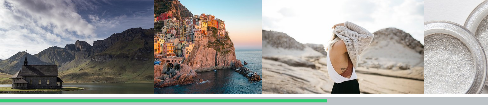

    

##     

React-smart-scroller is a library that allows you to create highly customizable horizontal or vertical scroller in easy way.

You can modify scrollbar track just like you want, adding some styles to it, and change look of
scrollbar thumb just simply passing styled JSX Element.

Define your own spacing or columns per scroller width simply passing props.

### Features

- Full responsiveness
- Every child is resized dependent on view cols
- Highly customizable track
- Possibility of passing own thumb (own component)
- Vertical scroll
- Spacing between columns
- Draggable content
- Well typed (Typescript)
- Server Side Rendering friendly

  

### [Live demo](https://codesandbox.io/embed/dark-cookies-gvh6p)

## Install
`yarn add react-smart-scroller` or `npm install --save react-smart-scroller`

## Props

Property      | Type                | Description
------------- | ------------------- | ------------------------
numCols       | number              | Default: `undefined`.  Number of columns per container width. If 1, width of each child is 100%. If not provided, column has childs width.
spacing       | number              | Default: `0`.  Space in pixels between elements.
trackProps    | React.CssProperties | Default: `undefined`.  CSS styles to original track.
thumb         | JSX.Element         | Default: `rectangle`.  Element that if provided overrides default rectangle.
vertical      | boolean             | Default: `false`.  Defines direction of scrollbar - horizontal by default. If height of ReactSmartScroller is not defined it will automatically resize to 100% and scroll will not be visible. 
draggable     | boolean             | Default: `false`.  Allows to scroll by dragging content.

## Usage

### Basic

Let's create our first component

    import React from 'react'
    import { ReactSmartScroller } from 'react-smart-scroller'
    
    const renderImages = () => {
        const images = [
            'https://cdn.pixabay.com/photo/2019/06/02/00/46/chapel-4245437__340.jpg',
            'https://cdn.pixabay.com/photo/2017/08/22/22/36/cinque-terre-2670762__340.jpg',
            'https://cdn.pixabay.com/photo/2016/08/01/20/34/girl-1562091__340.jpg',
            'https://cdn.pixabay.com/photo/2013/09/26/23/23/glitter-powder-186829__340.jpg',
            'https://cdn.pixabay.com/photo/2019/04/11/09/50/wave-4119274__340.jpg'
        ]
    
        return images.map((image, index) => (
            
        ))
    }
    
    export const Slider = () => (
        <ReactSmartScroller>
            {renderImages()}
        </ReactSmartScroller>
    )
    
This is what you'll see in your browser:

  

### numCols

    export const Slider = () => (
        <ReactSmartScroller numCols={3}>
            {renderImages()}
        </ReactSmartScroller>
    )

  

### spacing

    export const Slider = () => (
        <ReactSmartScroller spacing={24}>
            {renderImages()}
        </ReactSmartScroller>
    )
    

    

### trackProps

    export const Slider = () => (
        <ReactSmartScroller
            trackProps={{
                height: 25
            }}
        >
            {renderImages()}
        </ReactSmartScroller>
    )
    

    

### thumb

    export const Slider = () => (
        <ReactSmartScroller
            thumb={
                

            }
        >
            {renderImages()}
        </ReactSmartScroller>
    )
    

    

### vertical

    export const Slider = () => (
        

            <ReactSmartScroller vertical>
                {renderImages()}
            </ReactSmartScroller>
        

    )

    

### draggable

    export const Slider = () => (
        <ReactSmartScroller draggable>
            {renderImages()}
        </ReactSmartScroller>
    )
    

    

## todo

- [x] thumb width dependent on scrollWidth
- [x] vertical scroll
- [x] vertical scroll tests
- [x] improve documentation
- [x] more examples in usage
- [x] enable drag with mouse
