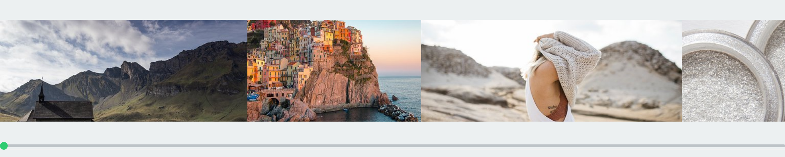

# react-smart-slider

React-smart-slider is a library that allows in easy way to construct horizontal slider.

  

### Features

- Horizontal scroll only
- Full responsiveness
- Every child is resized dependent of view cols

## Install
`yarn add react-smart-slider` or `npm install react-smart-slider`

## Props

Property      | Type          | Description
------------- | ------------- | ------------
numCols       | number        | Default: `1`.  Number of visible columns. If 1 width of each child is 100%.
spacing       | number        | Default: `0`.  Space in pixels between elements.
circleSize    | number        | Default: `15`.  Diameter of circle in pixels.
circleColor   | string        | Default: `#2ecc71`.  Color of circle.
trackHeight   | number        | Default: `5`.  Height of scroll track.
trackColor    | string        | Default: `#bdc3c7`.  Color of track.

## Usage

Let's create our first component

    import React from 'react'
    import { ReactSmartSlider } from 'react-smart-slider'
    
    const renderImages = () => {
        const styles = [
            'https://cdn.pixabay.com/photo/2019/06/02/00/46/chapel-4245437__340.jpg',
            'https://cdn.pixabay.com/photo/2017/08/22/22/36/cinque-terre-2670762__340.jpg',
            'https://cdn.pixabay.com/photo/2016/08/01/20/34/girl-1562091__340.jpg',
            'https://cdn.pixabay.com/photo/2013/09/26/23/23/glitter-powder-186829__340.jpg',
            'https://cdn.pixabay.com/photo/2019/04/11/09/50/wave-4119274__340.jpg'
        ]
    
        return styles.map(image => (
            <Image src={image}/>
        ))
    }
    
    export const Slider = () => (
        <ReactSmartSlider>
            {renderImages()}
        </ReactSmartSlider>
    )
    
This is what you'll see in your browser:

  

